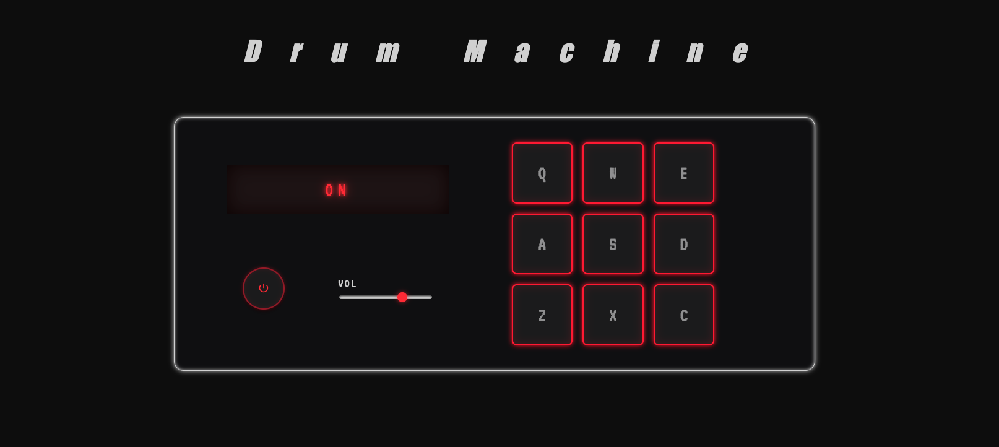

# Drum Machine

The course only asked for nine pads that play a sound when you click them or press their key, but I wanted to build something I'd be proud of. I researched real drum machines online and took inspiration from them: neon glow around the pads, animations when pressed, and a power button so people turn it on before playing. The hardest part was the volume slider. It isn't taught in the course, but the course expects you to research and find answers yourself, so I did. This project showed me how complex CSS can get, and how much JavaScript sits behind something that looks simple: state logic, event listeners for mouse and keyboard, and controlling audio. I'd like to keep improving it.

[Live demo](https://miguel-drum-machine.netlify.app)

## The brief

This is one of the five JavaScript certification projects. The course asked for a drum machine with nine pads (Q, W, E, A, S, D, Z, X, C) that play a sound when you click them or press their key. The HTML had to follow a fixed structure: each pad contains its own audio element, and that audio's id matches the pad's letter. It practises click and keyboard events and controlling audio from JavaScript.

## What I built beyond it

- **Power button.** When it's off, the pads, keys and volume slider stop responding and the interface dims. It starts off, so you press power to begin.
- **Retro screen.** The display shows the name of the sound you play, and ON or OFF when you press power, styled with CSS to look like an old machine.
- **Volume slider**, styled with the `-webkit` and `-moz` range-input pseudo-elements.
- **Pad pulse and glow.** Pads pulse and glow when pressed, the key letter brightens, and the animation replays cleanly on rapid presses.
- **Smooth transitions** between the on and off states.
- **Responsive layout.** The control panel stacks into one column on narrower screens, and the heading scales down on phones.

## Notable decisions

- **One `powerState` boolean** holds the machine's state. Every handler checks it first, and the power button flips it and updates the interface in one place (the `off` class, the slider's `disabled`, the display text).
- **Guard clauses** (`if (!powerState) return;`) stop sounds playing while the machine is off, instead of nesting everything inside an `if`.
- **One click listener per pad**, attached in a loop over `querySelectorAll(".drum-pad")`. Each pad finds its own audio with `querySelector(".clip")`.
- **One `keydown` listener on `document`** covers all nine keys. `event.key.toUpperCase()` gives the letter, and `getElementById(letter)` finds the matching clip. Keys that aren't pads find nothing and are ignored.
- **`currentTime = 0` before `play()`**, so a quick second press restarts the clip instead of waiting for it to finish.
- **The slider's `input` event** fires while dragging. `value / 100` converts the 0 to 100 range into the 0 to 1 that `audio.volume` needs, and a `forEach` applies it to every clip.

## What I learned

- Restarting a CSS animation needs a forced reflow (`void element.offsetWidth`) between removing and re-adding the class. The class is also removed on `animationend`.
- An animation overrides a transition on the same property, so the two can fight each other.
- `event.repeat` is read-only, and `classList.toggle(name, boolean)` forces a state instead of flipping it.
- A range input has to be reset with `appearance: none` before it can be styled, and each browser needs its own pseudo-elements.
- When audio cut off in Firefox, the same code worked fine in another browser. Test elsewhere before blaming the code.

## Known limitations

- The slider starts at 70, but the clips play at full volume until it's moved.
- Needs an internet connection for the audio clips and fonts.

## Built with

HTML, CSS and JavaScript. No frameworks or libraries. Deployed on Netlify.