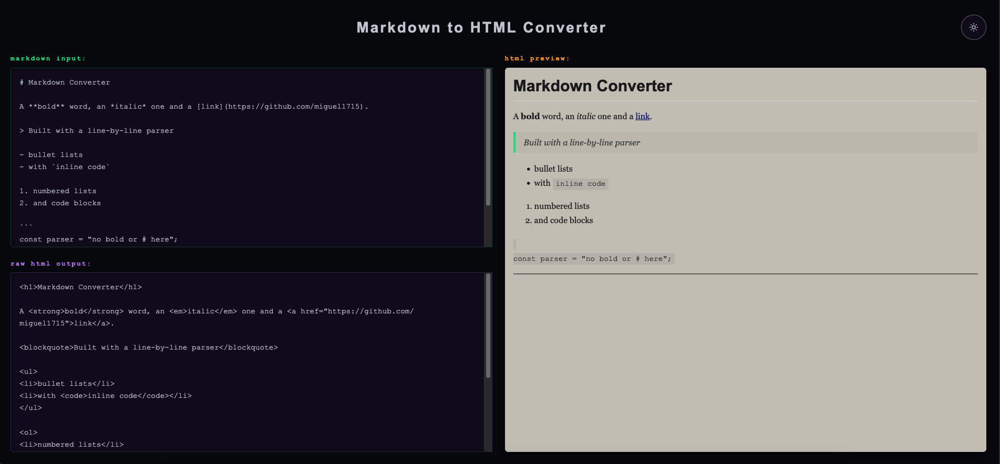
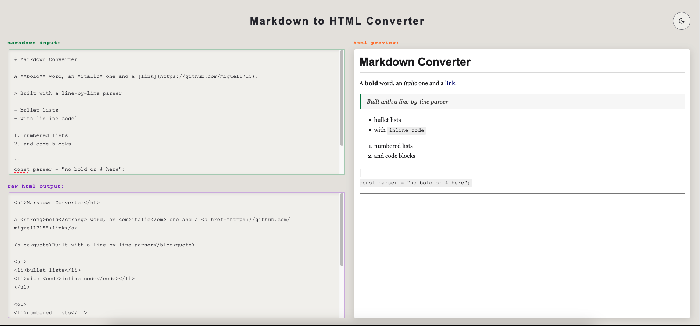

# Markdown to HTML Converter

I built this in two stages. First I did what freeCodeCamp asked for, using regex and `.replace()` to parse the markdown, which was a great way to learn how they work. Then I decided to go past the requirements. I redesigned the whole interface with a new layout and two themes, and I tried to cover the markdown people actually use: lists, code blocks and inline code.

That second part is where it got hard, and I think it's why freeCodeCamp keeps the requirements small. Every new feature broke something else, because each block needed its own state and had to fit around the others. It was the first project where the more I touched the code, the less I understood it. I decided to stop adding features when the next one would have meant rebuilding the whole structure, and to be honest it was getting way past my knowledge level. I now know why real converters tokenize the text first instead of working like this. It was frustrating, but it's the project I learned the most from.

[Live demo](https://markdown-converter-fcc.netlify.app/)






## The brief

This is one of the five JavaScript certification projects. The course provided the HTML and CSS, and my job was the JavaScript: a function called `convertMarkdown` that uses regular expressions to turn the text in `#markdown-input` into HTML as you type. It had to handle headings (levels 1 to 3), bold (`**` or `__`), italic (`*` or `_`), images, links and blockquotes. The raw HTML goes into `#html-output` and the rendered result into `#preview`.

## What I built beyond it

The course supplied a starting HTML and CSS. I redesigned the whole interface and extended the parser well past the required features.

### Interface (HTML and CSS)

- **New page structure and layout.** I restructured the HTML and built a CSS grid with two stacked panes on the left (markdown input and raw HTML) and a full-height preview on the right, under a header with the title and the theme button.
- **Two complete themes.** A dark and a light palette built with CSS custom properties, switched by a toggle with sun and moon SVG icons and a smooth colour transition. I tuned each palette separately for contrast.
- **A colour for each panel** (green for markdown, purple for raw HTML, orange for the preview), dark inset boxes for the code areas, and a paper-style preview with its own styling for headings, quotes, code and links.
- **Responsive layout.** The grid becomes a single column on small screens, and the header is built so the title and the toggle can't overlap.

### Functionality (JavaScript)

- **A line-by-line parser with state**, instead of a chain of `.replace()` calls, so it can handle elements that span several lines.
- **More markdown.** Bullet lists (`-` or `*`), numbered lists, fenced code blocks, inline code, horizontal rules and headings 4 to 6.
- **Comments that explain why**, so I can re-read the code later.

## Notable decisions

- **Rewrote the parser as a loop over lines.** My first version was a chain of `.replace()` calls. When I added lists, I found a chain can't group several lines into one `<ul>`, so I rebuilt it as a loop that remembers what it's inside.
- **Split block and inline elements into two functions.** Whole-line elements (headings, lists, code fences, `---`) depend on the lines around them, so `convertMarkdown` handles them in the loop. Things inside a line (bold, italic, links, images, inline code) are chained replaces in `convertInline`.
- **One boolean per open block** (`inList`, `inOrderedList`, `inCodeBlock`), each with an opener, a closer for when the next line isn't part of it, and a closer after the loop for when the input ends first. Once lists worked, I reused the same pattern for code blocks and numbered lists.
- **A code fence closes any open list first.** When I tested a list followed by a code block, the `<pre>` ended up inside the `<ul>`, so the fence now closes the list before it opens.
- **Fence lines are never pushed as text, and lines inside a block are pushed raw.** My first version printed the backticks, and a `#` or `**` inside a block would have turned into a heading or bold. `continue` now skips every other rule for those lines.
- **Inline code is handled with `` split("`") ``**, so `**` inside backticks doesn't turn into bold. Code pieces sit at the odd indexes and skip the other replaces.
- **Dropped `_italic_`.** The underscore matched inside URLs and broke links, so only `*italic*` works.

## What I learned

- A `.replace()` chain can't group across lines, which is why lists needed a loop with state. It also can't skip part of a string. Splitting on a delimiter and handling the pieces separately can.
- A code fence is a signal, not content. The opening and closing fence are the same line, so a flag decides which one it is.
- Separate `if` statements all run, while `if / else if / else` runs exactly one branch. My first fence handler used two separate `if`s, so it opened and closed the block on the same line.
- `continue` skips the rest of the current loop iteration and moves to the next line. It's the loop version of a guard clause.
- Order matters in a replace chain. Bold has to run before italic, because `**` would otherwise match the single-asterisk pattern.
- Regex anchors matter. An unanchored ordered-list pattern matched "1990. Then" in the middle of a sentence. And `[...]` means one of the characters, not a sequence.
- Comments should say why, not what. I couldn't read my own code four days later until I rewrote them that way.
- If I started again, I'd look at how libraries like marked and markdown-it work. They tokenize the text first and render it second. In my loop, every new block type has to know about the others (a fence closes a list, a list closes a numbered list), and the more I added, the more things broke.

## Known limitations

- No tables and no nested lists.
- No paragraph wrapping: consecutive lines merge without a blank line.
- No language tag after a code fence, like ` ```javascript `.
- HTML isn't escaped inside code blocks, so something like `<div>` renders as HTML instead of showing as text (the preview uses `innerHTML`).

## Built with

HTML, CSS and JavaScript. No frameworks or libraries. Deployed on Netlify.